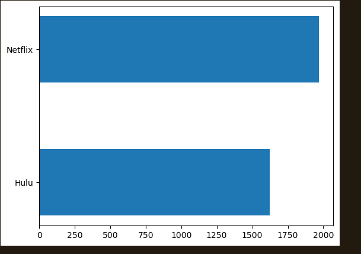
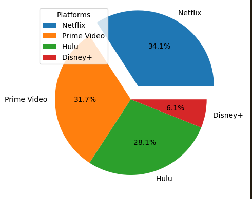

# 📊 Data Science & Analysis Portfolio

A collection of data analysis projects built with Python, exploring real-world datasets through cleaning, exploratory analysis, and visual storytelling — all inside Jupyter Notebooks.

---

## 🛠️ Tech Stack

**Language:** Python  
**Libraries:** pandas · NumPy · Matplotlib  
**Environment:** Jupyter Notebook

---

## 📁 Projects

### 1. Streaming Platform Catalog Analysis

**Notebook:** `pdproject1.ipynb`

**Objective:** Analyze a dataset of streaming content to uncover the distribution of Movies vs. TV Shows, compare catalog sizes across Netflix, Hulu, Prime Video, and Disney+, and identify the most popular release years.

**What I Did:**
- Cleaned the dataset by handling missing values and dropping irrelevant columns
- Grouped and aggregated data using `.value_counts()` and `.sum()` with method chaining
- Designed multi-panel subplot layouts combining pie charts and horizontal bar charts

---

## 📈 Key Visualizations & Insights





---

## 🚀 How to Run

```bash
# Clone the repository
git clone https://github.com/margaretnduta/DSA_Projects.git

# Navigate into the project
cd DSA_Projects

# Install dependencies
pip install pandas numpy matplotlib jupyter

# Launch Jupyter
jupyter notebook
```

---

## 📬 Let's Connect

[](https://www.linkedin.com/in/margaretwambui12/)
